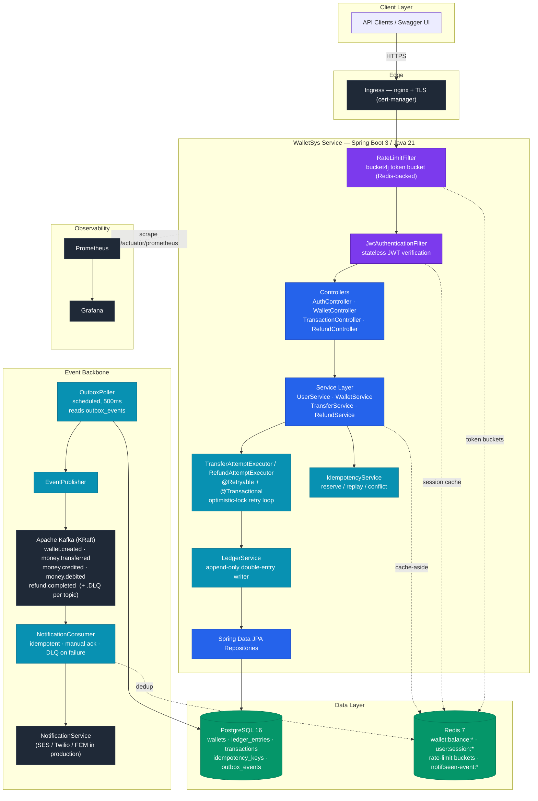
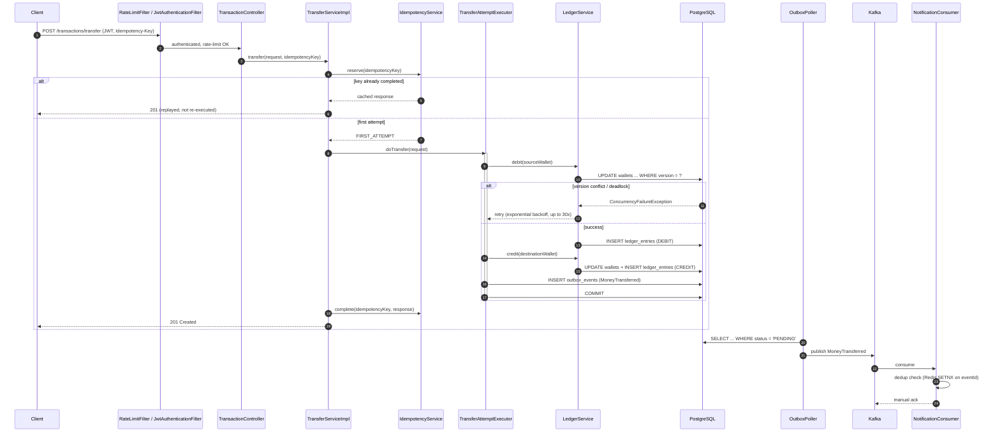
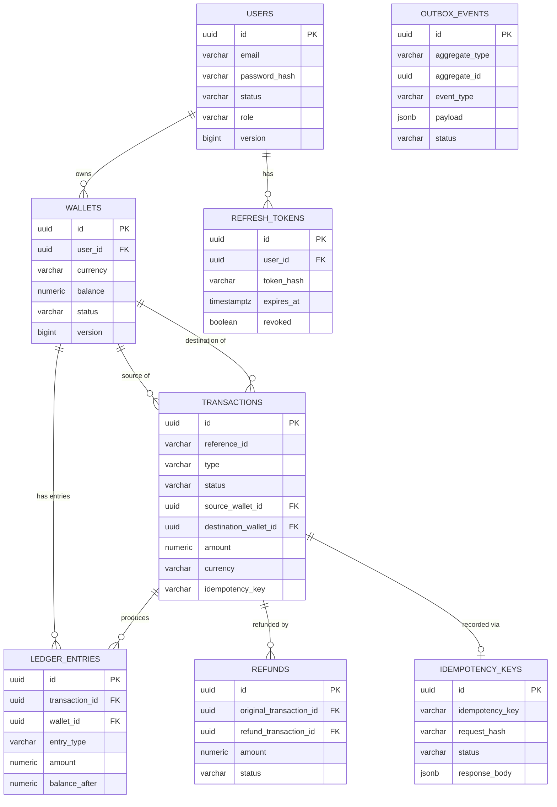

# WalletSys — Distributed Ledger & Digital Wallet Backend

A production-grade digital wallet backend modeled on the architecture patterns used by
Stripe, Razorpay, and Wise: an **immutable double-entry ledger**, **optimistic-locking
based double-spend prevention**, a **transactional outbox** for reliable event
publishing, and an **idempotency protocol** for safe client retries — built on Java 21
and Spring Boot 3.

This is not a CRUD app. Every design decision below exists because of a specific
correctness or scale requirement, and is explained rather than asserted.

---

## Table of Contents

- [System Design](#system-design)
- [Key Design Decisions](#key-design-decisions)
- [Features](#features)
- [Database Design](#database-design)
- [Tech Stack](#tech-stack)
- [Project Structure](#project-structure)
- [Setup — Local Development](#setup--local-development)
- [Setup — Docker Compose](#setup--docker-compose)
- [Deployment — Kubernetes](#deployment--kubernetes)
- [API Documentation](#api-documentation)
- [Testing](#testing)
- [Monitoring & Observability](#monitoring--observability)
- [Screenshots](#screenshots)
- [Future Improvements](#future-improvements)

---

## System Design

The diagram below is rendered natively by GitHub (Mermaid) — no external tool or image
export required to view it.



### Request Sequence — Wallet-to-Wallet Transfer



**Request flow for a transfer:**
1. `RateLimitFilter` checks a Redis-backed token bucket keyed by user id (or IP if unauthenticated).
2. `JwtAuthenticationFilter` verifies the JWT and populates the security context (cache-aside user lookup via Redis).
3. `TransactionController` validates the request body (`@Valid`) and requires an `Idempotency-Key` header.
4. `TransferServiceImpl` checks the idempotency protocol — replays a cached response if this key was already processed.
5. `TransferAttemptExecutor` runs the actual transfer inside one DB transaction: debit source, credit destination, write both ledger entries, write an outbox event — all committed atomically.
6. If a concurrent writer collides on the same wallet row, Spring's optimistic-lock/deadlock exception triggers an automatic retry with backoff (see [Concurrency & Double-Spend Prevention](#concurrency--double-spend-prevention)).
7. `OutboxPoller` (a separate scheduled job) picks up the outbox row and publishes it to Kafka — decoupled from the request/response cycle.
8. `NotificationConsumer` consumes the event and dispatches a (simulated) notification, idempotently.

---

## Key Design Decisions

### Concurrency & Double-Spend Prevention

**Optimistic locking (`@Version`) instead of pessimistic row locks.** At scale, a
popular wallet (e.g. a merchant account) receiving many concurrent transfers would
serialize every writer behind a `SELECT ... FOR UPDATE` lock if we used pessimistic
locking — capping throughput and creating a latency-amplifying queue. Instead, every
write to `wallets.balance` is guarded by a `version` column: the `UPDATE ... WHERE id =
? AND version = ?` either succeeds and bumps the version, or affects zero rows, which
Hibernate reports as an `OptimisticLockException`. The losing transaction rolls back
entirely (no partial ledger writes) and is retried by `TransferAttemptExecutor`
/ `RefundAttemptExecutor`, re-reading fresh state each time.

**Why the retry classification widened during testing.** Under real, sustained
concurrent write contention on a single wallet row (proven via a Testcontainers-backed
integration test — see [Testing](#testing)), PostgreSQL frequently reports genuine
**deadlocks** (`ShareLock on transaction X, blocked by process Y` — a mutual XID wait
cycle), not just clean optimistic-lock version mismatches. Spring translates these to
`CannotAcquireLockException`, a sibling of `OptimisticLockingFailureException` under
the common superclass `org.springframework.dao.ConcurrencyFailureException`. The retry
annotations target that common superclass, so both failure modes are retried
identically. A manually-invoked `entityManager.flush()` inside `LedgerServiceImpl`
(added to shrink the wallet row lock's lifetime) also required explicit exception
translation via `EntityManagerFactoryUtils.convertJpaAccessExceptionIfPossible()`,
since Spring's automatic translation only wraps exceptions crossing a repository proxy
boundary — a manual flush bypasses that.

**Retry tuning is empirical, not arbitrary.** `MAX_RETRY_ATTEMPTS = 30` with exponential
backoff (100ms → 2000ms cap, randomized jitter) was tuned by actually running many
concurrent writers against the same wallet row via Testcontainers and observing how many
retry cycles a deadlock storm needs to fully resolve. Lower values (5, 8, 10, 20) were
each insufficient at various concurrency levels during testing.

**Why not use a distributed lock (Redis/Zookeeper) instead?** A distributed lock adds
an extra network hop and failure mode (lock service unavailable = wallet unusable) for a
problem the database already solves natively and atomically. Optimistic locking scales
better here because failed attempts hold no lock at all while waiting to retry.

### Immutable Ledger

`ledger_entries` is append-only, enforced in two independent layers:
- **Application layer**: the `LedgerEntry` entity exposes no setters — only a builder used once at creation.
- **Database layer**: `trg_ledger_entries_no_update` / `trg_ledger_entries_no_delete` triggers reject any `UPDATE`/`DELETE` outright, so even a bug or a raw SQL statement bypassing the ORM cannot rewrite history.

Every business transaction produces a **balanced double-entry pair**: one `DEBIT` and
one `CREDIT`, summing to zero across the ledger. `wallets.balance` is a cached,
materialized projection of this ledger — never the source of truth — because
aggregating hundreds of millions of ledger rows on every balance check does not scale.
The balance is mutated only inside the same transaction that appends the corresponding
ledger entries, keeping the projection always consistent with its source.

### Transactional Outbox

Publishing an event *and* committing a database change is not atomic across two
different systems (Postgres + Kafka) without distributed transactions (2PC), which are
operationally painful and don't compose well with Kafka. Instead, `OutboxEventWriter`
writes an `outbox_events` row **inside the same DB transaction** as the business change.
A separate `OutboxPoller` scheduled job (polling every 500ms) reads `PENDING` rows and
publishes them to Kafka, marking them `PUBLISHED` or retrying/routing to a
`.DLQ` topic on failure. This guarantees the event is eventually published *if and only
if* the business transaction committed — with at-least-once delivery semantics, which
is why every consumer (`NotificationConsumer`) is written to be idempotent (deduped by
the event's own UUID via Redis `SETNX`).

*Why polling instead of Debezium/CDC?* Polling requires zero extra infrastructure and is
trivial to reason about and test. CDC (tailing the Postgres WAL) removes polling latency
entirely and is the natural upgrade path if event volume grows — the `outbox_events`
schema doesn't need to change to support it later.

### Idempotency Protocol

Every mutating endpoint (`transfer`, `credit`, `debit`, `refund`) requires a
client-generated `Idempotency-Key` header. `IdempotencyService.reserve()` attempts to
insert a row keyed by that value (protected by a unique DB constraint), using
`Propagation.REQUIRES_NEW` so the reservation is visible to concurrent requests
immediately, independent of the caller's larger transaction:

- **First attempt**: proceeds normally; the final response is cached against the key.
- **Retry with the same key + same payload**: the cached response is replayed verbatim — the operation is never re-executed.
- **Retry with the same key + a *different* payload**: rejected as `409 IDEMPOTENCY_KEY_CONFLICT` — a client bug, not a legitimate retry.
- **Concurrent request with the same key still in flight**: rejected as "in progress," not silently duplicated.

This is what makes the extensive retry logic above safe from a client's perspective:
retrying an entire HTTP request after a `409 CONCURRENT_MODIFICATION_RETRY_EXHAUSTED` or
a network timeout can never double-apply a transfer.

### JWT + Refresh Tokens

Access tokens are short-lived, stateless JWTs (HMAC-SHA signed) — verifiable by any node
in the fleet with zero DB round trips, which is what lets the service scale horizontally
behind a load balancer with no session affinity. Refresh tokens are the opposite:
long-lived, **opaque** random strings, stored server-side as a SHA-256 hash (never the
raw value) so a database leak alone cannot be used to mint new sessions. This also
allows **server-side revocation** (logout, suspected token theft) which a
purely-stateless JWT cannot provide without an additional denylist.

Refresh tokens rotate on every use (`RefreshTokenService.validateAndConsume` revokes the
presented token and issues a new one): if a stolen refresh token and the legitimate
user's copy are both used, whichever is used second finds the token already revoked —
a strong signal to force full re-authentication.

### Caching Strategy

Two independent Redis-backed caches, both fail-open (a Redis outage degrades to a DB
read, never breaks the request):

- **Wallet balance** (`wallet:balance:*`, 5 min TTL) — the highest-frequency read in the system.
- **User session** (`user:session:*`, 15 min TTL) — avoids a DB round trip on *every single authenticated request*, since `JwtAuthenticationFilter` runs on every request to populate the security context. Caches a minimal, JSON-serializable projection (`CachedUserSession`) rather than the full `UserDetails`/`GrantedAuthority` object graph, which doesn't round-trip cleanly through Redis.

### Rate Limiting

Token-bucket rate limiting via **bucket4j + Redis** (not an in-memory bucket per
instance), because a per-process bucket would let a client bypass the limit simply by
being load-balanced across different instances. Keyed by authenticated user id when
available, falling back to client IP for unauthenticated requests (protecting
`/auth/login` from credential stuffing). Uses the synchronous **Jedis** integration
rather than the async Lettuce client, because the rate-limit check itself is a
synchronous gate that must complete before the servlet filter chain proceeds — there's
no async benefit to gain, and Jedis's simpler connection-pool model is easier to reason
about for this specific access pattern.

---

## Features

- User registration, login, JWT + refresh token authentication
- Wallet creation (multi-currency, one wallet per user per currency)
- Wallet balance retrieval (Redis-cached)
- Credit (top-up) and debit (withdrawal)
- Wallet-to-wallet transfer
- Full and partial refunds against completed transactions
- Paginated transaction history and ledger statements
- Idempotency-key protocol on every mutating endpoint
- Kafka event streaming (`WalletCreated`, `MoneyTransferred`, `MoneyCredited`,
  `MoneyDebited`, `RefundCompleted`) with a dead-letter queue on both producer and
  consumer sides
- Notification consumer (simulated — logs what would be sent; swap in SES/Twilio/FCM)
- API rate limiting (Redis-backed token bucket)
- Global exception handling with a uniform error contract
- OpenAPI/Swagger documentation with JWT bearer auth wired into "Try it out"
- Full observability: Prometheus metrics + Grafana dashboard

---

## Database Design

### Entity-Relationship Diagram



### Normalization & Key Design

- All tables are in **3NF**: no repeating groups, every non-key attribute depends only
  on the primary key. `wallets.balance` is the one deliberate denormalization — a
  cached, derived value from `ledger_entries`, justified because recomputing an
  aggregate over an unbounded, append-only history on every balance check does not
  scale. It is documented as such (see `V1__init_schema.sql` comments) and only ever
  mutated transactionally alongside its source-of-truth ledger rows.
- **UUIDs, not sequential bigints**, for every primary key: avoids leaking sequential
  IDs (enumeration risk on a financial API) and allows client- or service-generated IDs
  without a round trip.
- **`NUMERIC(19,4)`**, never floating point, for all monetary amounts — exact decimal
  arithmetic with no rounding drift across billions of transactions.

### Indexing Rationale

| Index | Why |
|---|---|
| `uq_users_email_lower` (unique, `LOWER(email)`) | Case-insensitive login lookup is the hot path |
| `uq_wallet_user_currency` | Enforces one wallet per (user, currency) at the DB level, not just app-level |
| `idx_transactions_source_wallet_id` / `_destination_wallet_id` (composite with `created_at DESC`) | Transaction history is always "for this wallet, most recent first" |
| `idx_ledger_entries_wallet_id` (composite with `created_at DESC`) | Wallet statement queries — the ledger's own hot read path |
| `idx_outbox_events_status_created_at` (**partial index**, `WHERE status = 'PENDING'`) | The outbox poller's hot query scans only pending rows; a partial index keeps this scan cost constant regardless of how many historical `PUBLISHED` rows accumulate |
| `uq_idempotency_key` (unique) | Atomicity for the idempotency-key reservation race — the DB constraint, not application logic, is what actually prevents two concurrent identical requests from both proceeding |

Full schema with inline rationale comments: [`src/main/resources/db/migration/V1__init_schema.sql`](src/main/resources/db/migration/V1__init_schema.sql).

---

## Tech Stack

| Layer | Technology | Purpose |
|---|---|---|
| Language & Runtime | **Java 21** (LTS) | Records, pattern matching, virtual-thread-ready runtime |
| Application Framework | **Spring Boot 3.3** | Auto-configuration, embedded Tomcat, production-ready defaults |
| Web Layer | **Spring MVC** | REST controllers, servlet-based request handling |
| Security | **Spring Security 6**, **JJWT (io.jsonwebtoken)**, **BCrypt** | Stateless JWT auth, filter chain, password hashing |
| Persistence | **Spring Data JPA / Hibernate** | Entity-repository mapping, optimistic locking (`@Version`) |
| Relational Database | **PostgreSQL 16** | System of record — ledger, wallets, transactions |
| Schema Migration | **Flyway** | Versioned, auditable schema changes |
| Object Mapping | **MapStruct** | Compile-time-generated entity ↔ DTO mappers (zero reflection overhead) |
| Caching | **Redis 7** (Spring Data Redis + dedicated **Jedis** pool) | Wallet balance cache, session cache, rate-limit buckets |
| Rate Limiting | **Bucket4j** | Distributed token-bucket algorithm backed by Redis |
| Messaging / Event Streaming | **Apache Kafka** (KRaft mode) | Domain event bus — wallet/transaction/refund events |
| Resilience | **Spring Retry** | Exponential-backoff retry on optimistic-lock/deadlock contention |
| API Documentation | **springdoc-openapi** (OpenAPI 3 / Swagger UI) | Interactive, auth-aware API docs |
| Build Tool | **Gradle** (wrapper committed) | Dependency management, multi-stage build orchestration |
| Unit & Integration Testing | **JUnit 5**, **Mockito**, **AssertJ** | Business-logic and contract verification |
| Test Infrastructure | **Testcontainers**, **Awaitility** | Disposable, real Postgres/Kafka/Redis instances for integration tests |
| Containerization | **Docker** (multi-stage build), **Docker Compose** | Reproducible local/dev environment |
| Container Orchestration | **Kubernetes** (Kustomize) | Deployment, HPA, PDB, Ingress manifests |
| CI/CD | **GitHub Actions** | Build, test, and image publish pipeline |
| Metrics & Dashboards | **Micrometer → Prometheus → Grafana** | Application + JVM + infra observability |
| Logging | **SLF4J + Logback** | Structured, trace-ID–tagged console and rolling-file logs |

### Tools & Developer Workflow

| Category | Tool |
|---|---|
| IDE-agnostic build | Gradle Wrapper (`./gradlew`) — no local Gradle install required |
| API exploration | Swagger UI (`/swagger-ui/index.html`), Postman-compatible OpenAPI export |
| Local infra bootstrap | Docker Compose / Podman Compose |
| Container runtime (dev-verified) | Docker Engine or Podman (rootless-compatible) |
| Database inspection | `psql` / any PostgreSQL client (DBeaver, TablePlus) |
| Cache inspection | `redis-cli` |
| Kafka inspection | `kafka-console-consumer`, Kafdrop (optional) |
| Load/traffic simulation (planned) | k6 / Gatling — see [Future Improvements](#future-improvements) |
| Version control | Git, GitHub (Actions for CI/CD, Container Registry for images) |

---

## Project Structure

```
src/main/java/com/walletsys/
├── controller/       REST controllers — thin, delegate to services
├── service/          Service interfaces
│   └── impl/         Implementations, incl. TransferAttemptExecutor/RefundAttemptExecutor
├── repository/        Spring Data JPA repositories
├── entity/            JPA entities + enums
├── dto/               request/ and response/ DTOs
├── mapper/             MapStruct entity↔DTO mappers
├── config/             Spring @Configuration classes (security, Redis, Kafka, OpenAPI, rate limit)
├── security/           JWT service/filter, refresh tokens, UserPrincipal
├── exception/          Exception hierarchy + GlobalExceptionHandler
├── cache/               Redis-backed caches (wallet balance, user session)
├── kafka/
│   ├── event/          Event payload records
│   ├── producer/        EventPublisher
│   ├── consumer/        NotificationConsumer, dedup service
│   └── outbox/           OutboxEventWriter, OutboxPoller
└── idempotency/         IdempotencyService

src/test/java/com/walletsys/
├── unit/                Mockito-based unit tests, no Spring context
└── integration/          Testcontainers-backed integration tests (real Postgres/Kafka/Redis)

docker/                    Prometheus + Grafana provisioning
k8s/                        Kubernetes manifests (kustomize)
.github/workflows/          CI/CD pipeline
```

---

## Setup — Local Development

### Prerequisites

- Java 21 (Temurin recommended)
- PostgreSQL 16 running locally (or via Docker — see below)
- Redis 7
- Kafka (KRaft mode; see `docker-compose.yml` for a working single-node config)

### Run

```bash
# Start just the infra dependencies via Docker, run the app on the host with Gradle
podman compose up -d postgres redis kafka   # or `docker compose up -d ...`

export JWT_SECRET=$(openssl rand -base64 32)
./gradlew bootRun
```

The app starts on `http://localhost:8080`. Flyway migrations run automatically on
startup. Swagger UI: `http://localhost:8080/swagger-ui/index.html`.

### Run tests

```bash
# Unit tests only
./gradlew test --tests "com.walletsys.unit.*"

# Full suite (requires Docker/Podman — Testcontainers manages Postgres/Kafka/Redis itself)
./gradlew test
```

---

## Setup — Docker Compose

Brings up the entire stack: Postgres, Redis, Kafka, the app, Prometheus, and Grafana.

```bash
cp .env.example .env
# edit .env — set a real JWT_SECRET at minimum

docker compose up -d --build
```

| Service | URL |
|---|---|
| App | http://localhost:8080 |
| Swagger UI | http://localhost:8080/swagger-ui/index.html |
| Prometheus | http://localhost:9090 |
| Grafana | http://localhost:3000 (admin / value of `GRAFANA_ADMIN_PASSWORD`) |

Verify:

```bash
curl http://localhost:8080/actuator/health
```

---

## Deployment — Kubernetes

```bash
kubectl apply -k k8s/
kubectl -n walletsys get pods -w
```

See [`k8s/README.md`](k8s/README.md) for the full manifest reference, production
checklist (replacing the placeholder `Secret`, pointing at managed
RDS/ElastiCache/MSK instead of the bundled dev-only StatefulSets, TLS setup), and why
the bundled Postgres/Redis/Kafka StatefulSets are explicitly marked **local/dev only**.

---

## API Documentation

Full interactive documentation (request/response schemas, try-it-out with JWT auth) is
served at `/swagger-ui/index.html` once the app is running. Summary:

| Method | Path | Auth | Idempotency-Key | Description |
|---|---|---|---|---|
| POST | `/api/v1/auth/register` | – | – | Register a new user |
| POST | `/api/v1/auth/login` | – | – | Login, receive access + refresh token |
| POST | `/api/v1/auth/refresh` | – | – | Rotate a refresh token for a new pair |
| POST | `/api/v1/auth/logout` | – | – | Revoke a refresh token |
| GET | `/api/v1/users/me` | ✅ | – | Current user profile |
| POST | `/api/v1/wallets` | ✅ | – | Create a wallet |
| GET | `/api/v1/wallets` | ✅ | – | List my wallets |
| GET | `/api/v1/wallets/{id}` | ✅ | – | Wallet details |
| GET | `/api/v1/wallets/{id}/balance` | ✅ | – | Current balance (cached) |
| GET | `/api/v1/wallets/{id}/statement` | ✅ | – | Paginated ledger statement |
| POST | `/api/v1/transactions/transfer` | ✅ | **required** | Transfer between wallets |
| POST | `/api/v1/transactions/credit` | ✅ | **required** | Top up a wallet |
| POST | `/api/v1/transactions/debit` | ✅ | **required** | Withdraw from a wallet |
| GET | `/api/v1/transactions/{id}` | ✅ | – | Transaction details |
| GET | `/api/v1/transactions/wallet/{id}/history` | ✅ | – | Paginated transaction history |
| POST | `/api/v1/refunds` | ✅ | **required** | Refund a completed transaction |
| GET | `/api/v1/refunds/{id}` | ✅ | – | Refund details |

Every response follows one of two envelopes:

```json
// success
{ "success": true, "data": { ... }, "message": "...", "timestamp": "..." }

// error
{ "success": false, "errorCode": "INSUFFICIENT_BALANCE", "message": "...", "status": 422, "path": "...", "timestamp": "..." }
```

`errorCode` is stable and machine-readable; branch your client logic on it, not on
`message` (which may change wording).

---

## Testing

# Ledger-Digital-Wallet

**Unit tests** (`src/test/java/com/walletsys/unit`) — Mockito, no Spring context:
double-entry ledger arithmetic, JWT generation/validation, the idempotency
reserve/replay/conflict state machine, and transfer/refund business-rule rejections
(ownership, frozen wallets, currency mismatches, over-refunding).

**Integration tests** (`src/test/java/com/walletsys/integration`) — Testcontainers spins
up real PostgreSQL, Kafka, and Redis:

- `TransferFlowIntegrationTest`: the full credit → transfer → refund lifecycle through
  real infrastructure, proving the outbox pattern, ledger, and idempotency protocol work
  together correctly — not just individually mocked. Also proves idempotency-key replay
  prevents double-application of a retried request.
- `ConcurrentTransferIntegrationTest`: **the double-spend-prevention proof.** Several
  threads hit one wallet simultaneously (via a `CountDownLatch` barrier) with the wallet
  funded for fewer transfers than attempts made. Asserts exactly the affordable number
  succeed, the rest fail cleanly with `InsufficientBalanceException`, and the wallet's
  final balance is exactly zero — never negative, never corrupted.

```bash
./gradlew test
```

---

## Monitoring & Observability

- **Metrics**: exposed at `/actuator/prometheus` via Micrometer (HTTP request
  rates/latency, JVM memory, HikariCP pool stats, Kafka producer metrics).
- **Logs**: structured console + rolling file (`logback-spring.xml`), trace-id-tagged.
- **Health**: `/actuator/health` with dedicated `liveness`/`readiness` probe groups for
  Kubernetes.
- **Grafana dashboard** (auto-provisioned, `docker/grafana/provisioning/`): HTTP request
  rate by endpoint/status, p95 latency, JVM heap, HikariCP active/idle connections, 5xx
  error rate, Kafka producer throughput.

---

## Screenshots

> _Placeholders — replace with real screenshots once the stack is running locally._

- `docs/screenshots/swagger-ui.png` — Swagger UI overview
- `docs/screenshots/grafana-dashboard.png` — Grafana dashboard
- `docs/screenshots/transfer-flow.png` — Example transfer request/response in Swagger

---

## Future Improvements

- **CDC-based outbox** (Debezium) instead of DB polling, once event volume justifies the
  extra infrastructure — the `outbox_events` schema already supports this migration
  without changes.
- **Multi-currency conversion** — currently a transfer requires matching currencies on
  both wallets; a real product would need an FX rate service and a conversion-fee model.
- **Fraud/risk scoring** hook on the transfer path (currently out of scope).
- **Real notification providers** (SES/Twilio/FCM) behind `NotificationService` — the
  interface already isolates this from the Kafka consumer wiring.
- **Per-tier rate limits** (free vs. paid plans) — currently one global limit; the
  `RateLimitFilter` key resolution already supports swapping in a per-user
  `BucketConfiguration` lookup.
- **Read replicas** for statement/history queries once read load grows past what a
  single Postgres primary should serve.
- **Distributed tracing** (OpenTelemetry) across the HTTP → Kafka → consumer boundary,
  beyond the current single-process trace-id logging.
- **Load testing** (k6/Gatling) to establish real throughput/latency baselines beyond
  the correctness-focused concurrency test in this repo.
